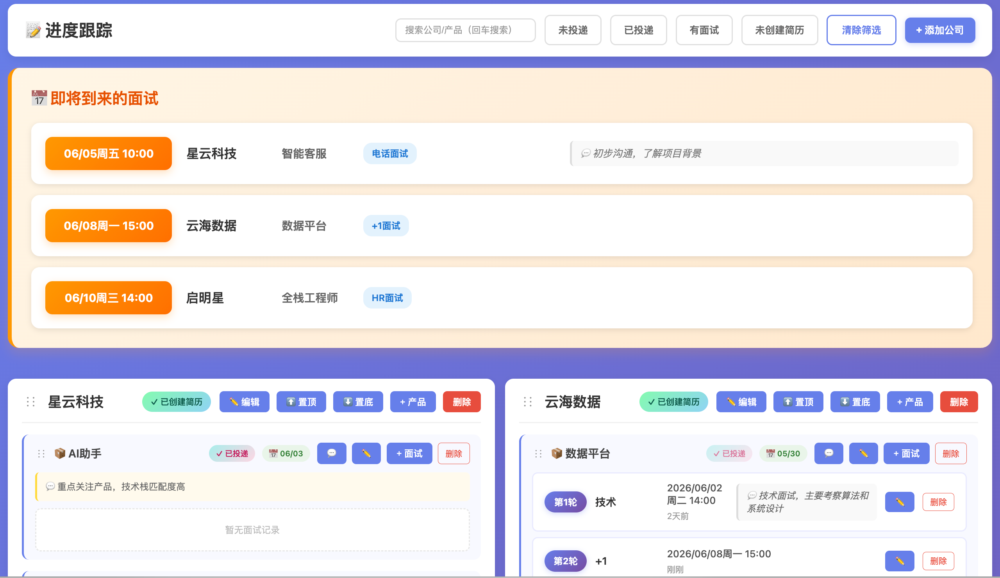

# 📝 进度跟踪系统

一个简洁美观的求职进度管理工具，帮助你系统化地跟踪多家公司、多个产品的投递和面试流程。

## 🎨 界面预览



## ✨ 功能特性

- 🔍 **搜索与筛选**：
  - 搜索框：按公司名或产品名搜索（回车生效）
  - **未投递**：显示所有未投递的产品
  - **已投递**：显示已投递但无面试的产品（按投递时间降序）
  - **有面试**：显示已有面试记录的产品
  - **未创建简历**：筛选需要准备简历的公司
  - 智能匹配：公司匹配显示全部，产品匹配只显示该产品
  
- 📅 **即将到来的面试**：
  - 自动显示今天及以后的面试
  - 按时间升序排列
  - 醒目的橙色提醒样式
  
- 🏢 **公司管理**：
  - 添加公司，记录简历创建状态（点击切换：未创建 → 已创建 → 无需 → 未创建）
  - 支持拖拽排序
  - 快速置顶/置底按钮
  - 删除公司
  
- 📦 **产品管理**：
  - 每个公司可以有多个产品线/岗位
  - **投递状态管理**：点击切换已投递/未投递
  - **投递时间记录**：切换为已投递时自动记录当前日期
  - **投递时间编辑**：点击绿色日期标签可修改投递时间
  - 产品备注：记录额外信息
  - 支持拖拽排序
  - 删除产品
  
- 📅 **面试记录**：
  - 支持类型：电话面试、技术面试、+1面试、+2面试、交叉面试、HR面试，支持自定义类型
  - 自动按时间排序
  - 面试备注功能
  - 编辑和删除面试记录
  
- ⏰ **时间追踪**：
  - 显示具体日期时间（含星期）
  - 显示相对时间（3天前）
  - **投递时间显示**：精确到天，绿色标签展示
  - **自动计算工作日**（排除周末）
  
- 💾 **数据持久化**：数据存储在本地 JSON 文件，安全可靠
  - 支持多数据文件切换
  - 可配置演示数据用于截图分享

## 🛠️ 技术栈

- **前端**：Vue 3 + Vite
- **后端**：Node.js + Express
- **存储**：本地 JSON 文件
- **样式**：原生 CSS（渐变背景 + 卡片设计）

## 📁 项目结构

```
intervWeb/
├── backend/              # Node.js 后端
│   ├── data/
│   │   └── interv.json  # 数据文件（自动创建）
│   ├── package.json
│   └── server.js
├── frontend/             # Vue 前端
│   ├── App.vue
│   ├── index.html
│   ├── main.js
│   ├── style.css
│   ├── package.json
│   └── vite.config.js
├── serve.sh              # 🎯 服务管理脚本（启动/停止/重启/状态）
├── README.md             # 详细文档
├── QUICKSTART.md         # 快速指南
└── .gitignore
```

## 🚀 快速开始

### 使用管理脚本（推荐）

```bash
# 启动服务（使用默认数据文件 interv.json）
./server.sh restart

# 使用演示数据启动（用于截图/演示，不包含真实信息）
./server.sh restart demo.json

# 停止服务
./server.sh stop

# 查看帮助
./server.sh help
```

脚本会自动：
- 检查并安装依赖
- 启动后端（端口 40001）
- 启动前端（端口 40000）
- 支持指定不同的数据文件

### 手动启动

#### 1. 安装依赖

```bash
# 安装后端依赖
cd backend
npm install

# 安装前端依赖
cd ../frontend
npm install
```

#### 2. 启动后端服务

```bash
cd backend
npm start
```

后端将运行在 `http://localhost:40001`

#### 3. 启动前端服务

打开新终端窗口：

```bash
cd frontend
npm run dev
```

前端将运行在 `http://localhost:40000`

### 访问应用

在浏览器中打开 `http://localhost:40000`

## 📖 使用指南

### 添加公司
1. 点击右上角"+ 添加公司"按钮
2. 输入公司名称
3. 点击确定
4. 点击简历状态可切换：未创建 → 已创建 → 无需 → 未创建

### 添加产品
1. 在公司卡片中点击"+ 产品"按钮
2. 输入产品名称（如：广告系统、推荐引擎）
3. 点击确定

### 记录投递
1. 点击产品的"✗ 未投递"状态
2. 自动切换为"✓ 已投递"并记录当前日期
3. 点击绿色日期标签（📅 06/05）可修改投递时间

### 记录面试
1. 在产品下点击"+ 面试"按钮
2. 选择面试类型（电话/技术/+1/+2/交叉/HR/自定义）
3. 选择面试时间
4. 可选：添加备注（面试官、题目等）
5. 点击确定

### 使用筛选
- **未投递**：查看待投递的产品
- **已投递**：查看已投递但无面试的产品（按投递时间降序，最新的在前）
- **有面试**：查看已有面试记录的产品
- **未创建简历**：查看需要准备简历的公司

### 排序和整理
- **拖拽排序**：按住公司/产品左侧的"⋮⋮"图标拖动
- **快速置顶**：点击公司卡片的"⬆️ 置顶"按钮
- **快速置底**：点击公司卡片的"⬇️ 置底"按钮

### 查看统计
- 每轮面试会显示：
  - 轮次编号
  - 面试类型
  - 具体日期时间
  - 距今时间（相对时间）
- 最后会显示距离最近一次面试的**工作日天数**（自动排除周末）

## 💾 数据存储

所有数据保存在 `backend/data/` 目录中的 JSON 文件。

### 默认数据文件
- `interv.json` - 你的真实数据
- `demo.json` - 演示数据（用于截图分享，不包含个人信息）

### 切换数据文件
```bash
# 使用默认数据文件
./server.sh restart

# 使用演示数据
./server.sh restart demo.json

# 使用自定义数据文件
./server.sh restart my-data.json
```

### 数据备份
```bash
# 备份当前数据
cp backend/data/interv.json backend/data/interv-backup-$(date +%Y%m%d).json
```

### 数据结构示例
```json
[
  {
    "id": 1001,
    "name": "星云科技",
    "resumeCreated": true,
    "products": [
      {
        "id": 2001,
        "name": "AI助手",
        "submitted": true,
        "submittedDate": "2026-06-03",
        "notes": "重点关注产品",
        "intervs": [
          {
            "id": 3001,
            "type": "技术",
            "date": "2026-06-05T14:00",
            "notes": "技术面试，主要考察算法"
          }
        ],
        "order": 0
      }
    ],
    "order": 0
  }
]
```

## 🔧 开发命令

### 后端
```bash
npm start      # 启动服务器
npm run dev    # 开发模式（带热重载）
```

### 前端
```bash
npm run dev    # 开发服务器
npm run build  # 构建生产版本
npm run preview # 预览生产构建
```

## 🔌 端口配置

- **前端服务**：http://localhost:40000
- **后端服务**：http://localhost:40001

可以通过环境变量修改后端端口：
```bash
PORT=8080 npm start  # 在 backend 目录下运行
```

## 📝 API 接口

| 方法 | 路径 | 说明 |
|------|------|------|
| GET | `/api/companies` | 获取所有公司数据 |
| POST | `/api/companies` | 添加公司 |
| DELETE | `/api/companies/:id` | 删除公司 |
| POST | `/api/companies/:id/products` | 添加产品 |
| DELETE | `/api/companies/:cid/products/:pid` | 删除产品 |
| POST | `/api/companies/:cid/products/:pid/interv` | 添加面试 |
| DELETE | `/api/companies/:cid/products/:pid/interv/:iid` | 删除面试 |

## 🎯 工作日计算逻辑

工作日计算会自动排除：
- 周六（dayOfWeek === 6）
- 周日（dayOfWeek === 0）

计算从面试日期的**第二天**开始，到今天为止的工作日天数。

## 📌 注意事项

1. **后端必须先启动**：前端依赖后端 API
2. **数据文件位置**：`backend/data/interv.json`
3. **备份建议**：定期备份 `interv.json` 文件
4. **Git 管理**：可以将 `interv.json` 加入版本控制，方便跨设备同步

## 🚧 后续改进方向

- [ ] 添加数据导出功能（Excel/PDF）
- [ ] 面试状态标记（通过/挂掉/待定）
- [ ] 统计面板（总面试次数、平均周期等）
- [ ] 提醒功能（距离上次面试过久提醒）
- [ ] 多人协作（用户系统）
- [ ] 移动端适配优化

## 📄 License

MIT

---

**祝你面试顺利！💪**
